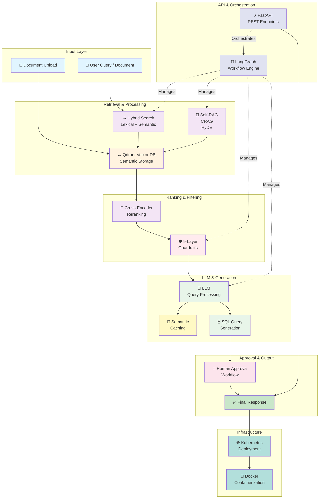

## Technology Stack Summary

| Component | Technologies |
|-----------|--------------|
| **Backend Framework** | FastAPI, LangGraph |
| **Vector Database** | Qdrant |
| **LLM & RAG** | Self-RAG, CRAG, HyDE |
| **Retrieval** | Hybrid Search (Lexical + Semantic) |
| **Ranking** | Cross-Encoder Reranking |
| **Query Generation** | SQL Query with Human Approval |
| **Security** | 9-Layer Guardrails |
| **Performance** | Semantic Caching |
| **Languages** | Python (81.8%), JavaScript (7.6%), CSS (5.4%) |
| **Deployment** | Kubernetes, Docker |

## End-to-End Flow

1. **Input** → User submits query or uploads document
2. **Retrieval** → Hybrid search combines lexical and semantic methods
3. **Vector Storage** → Qdrant stores and retrieves semantic embeddings
4. **Advanced RAG** → Self-RAG, CRAG, and HyDE process documents intelligently
5. **Ranking** → Cross-encoder reranks results for relevance
6. **Safety** → 9-layer guardrails filter malicious/harmful content
7. **LLM Processing** → Language model generates queries/responses with caching
8. **Approval** → SQL queries and critical operations require human approval
9. **Response** → Final output delivered via FastAPI REST endpoints
10. **Deployment** → Runs on Kubernetes with Docker containerization